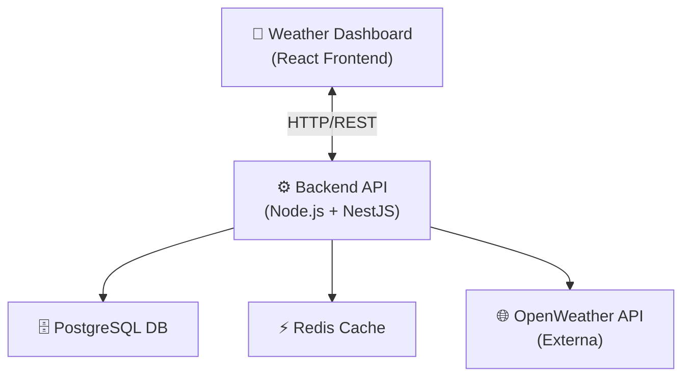

📌 Inovia Weather Challenge

Esse repositório contém a solução completa para a aplicação de previsão do tempo desenvolvida no Inovia Weather Challenge. O objetivo é coletar dados climáticos em tempo real, processá-los e transformá-los em dashboards, relatórios e alertas úteis para gestores públicos e cidadãos.

🧱 Visão Geral da Arquitetura

A solução é dividida em três blocos principais:

+-----------------------+        +----------------------+   
|  Weather Dashboard    |        |  Backend API         |
|  (React Frontend)     | <----> |  Node.js + Express   |
+-----------------------+        +----------------------+
                                        |
                                        v
                               +-----------------------+
                              |  PostgreSQL DB        |
                              +-----------------------+
                                        |
                                        v
                              +-----------------------+
                              |   Redis Cache         |
                              +-----------------------+

Componentes

🟦 Frontend:
Aplicação React responsiva que consome a API para listar previsões, alertas e métricas climáticas.

🟧 Backend (API):
Servidor API REST (Node.js + Express) que:

Busca dados em APIs externas (OpenWeather etc.)

Normaliza/transforma informações

Guarda históricos no banco

Serve endpoints consumíveis pelo frontend

🟩 PostgreSQL (Banco Relacional):
Guarda dados estruturados de previsões, cidades, usuários e métricas históricas.

🟨 Redis (Cache):
Cache de respostas frequentes para reduzir latência e carga de APIs externas, suportando alta demanda.

⚙️ Por que PostgreSQL?

PostgreSQL foi escolhido por ser um banco de dados relacional robusto, com suporte a transações ACID, escalabilidade vertical e horizontal (com Citus, utilizável em produção). Isso o torna ideal para dados estruturados e historicamente relacionados por cidade, tempo e métricas meteorológicas.

Além disso:

Permite consultas complexas de tempo (ex.: médias por período)

Tem suporte a índices, agregações e integrações com BI

É open-source e amplamente usado em aplicações críticas

⚡ Por que Redis?

Redis é um banco de dados de cache em memória extremamente rápido, usado para:

Armazenar dados de previsão de tempo frequentemente acessados

Reduzir número de chamadas às APIs de terceiros (como OpenWeather)

Suportar um grande número de usuários simultâneos com baixa latência

O uso de Redis melhora a performance, escalabilidade e experiência do usuário durante picos de acesso.

🔌 Endpoints Documentados
🌤️ GET /weather/current

Retorna o clima atual para uma cidade.

Query Params:

Parâmetro	Tipo	Obrigatório
city	string	sim

Response (exemplo):

{
  "city": "Rio de Janeiro",
  "temperature": 27,
  "condition": "Parcialmente nublado",
  "humidity": 70
}

🌦️ GET /weather/forecast

Retorna a previsão dos próximos dias para uma cidade.

Query Params:

Parâmetro	Tipo	Obrigatório
city	string	sim
days	number	não (default = 7)

Response:

{
  "city": "Rio de Janeiro",
  "forecast": [
    {"date":"2026-02-09","high":28,"low":20,"condition":"Sol"},
    {"date":"2026-02-10","high":27,"low":21,"condition":"Chuva leve"}
  ]
}

📊 GET /reports/historical

Retorna histórico climatológico baseado em período.

Query Params:

Parâmetro	Tipo	Obrigatório
city	string	sim
startDate	string (ISO)	sim
endDate	string (ISO)	sim
📍 POST /alerts

Cadastra um alerta para condições específicas (ex.: chuva > 80%).

Body:

{
  "city": "São Paulo",
  "condition": "chuva",
  "threshold": 80
}

📈 Fluxo de Dados – Passo a Passo

Frontend solicita previsão → Backend API

Backend verifica cache Redis

Se existe resposta válida → retorna imediatamente

Se não → busca API externa de clima

Resultado processado e salvo em Redis + PostgreSQL

Backend retorna JSON ao frontend

Frontend exibe dados ao usuário

🧠 Fluxograma de Requisição
Frontend ──> API Request?
               │
               ├── Cache Redis?
               │     ├── YES → return (Cache)
               │     └── NO  → fetch API externa
               │                │
               │                ├── transform data
               │                │📌 Inovia Weather Challenge

Esse repositório contém a solução completa para a aplicação de previsão do tempo desenvolvida no Inovia Weather Challenge. O objetivo é coletar dados climáticos em tempo real, processá-los e transformá-los em dashboards, relatórios e alertas úteis para gestores públicos e cidadãos.

🧱 Visão Geral da Arquitetura

A solução é dividida em três blocos principais:

+-----------------------+        +----------------------+   
|  Weather Dashboard    |        |  Backend API         |
|  (React Frontend)     | <----> |  Node.js + Express   |
+-----------------------+        +----------------------+
                                        |
                                        v
                              +-----------------------+
                              |  PostgreSQL DB        |
                              +-----------------------+
                                        |
                                        v
                              +-----------------------+
                              |   Redis Cache         |
                              +-----------------------+

Componentes

🟦 Frontend:
Aplicação React responsiva que consome a API para listar previsões, alertas e métricas climáticas.

🟧 Backend (API):
Servidor API REST (Node.js + Express) que:

Busca dados em APIs externas (OpenWeather etc.)

Normaliza/transforma informações

Guarda históricos no banco

Serve endpoints consumíveis pelo frontend

🟩 PostgreSQL (Banco Relacional):
Guarda dados estruturados de previsões, cidades, usuários e métricas históricas.

🟨 Redis (Cache):
Cache de respostas frequentes para reduzir latência e carga de APIs externas, suportando alta demanda.

⚙️ Por que PostgreSQL?

PostgreSQL foi escolhido por ser um banco de dados relacional robusto, com suporte a transações ACID, escalabilidade vertical e horizontal (com Citus, utilizável em produção). Isso o torna ideal para dados estruturados e historicamente relacionados por cidade, tempo e métricas meteorológicas.

Além disso:

Permite consultas complexas de tempo (ex.: médias por período)

Tem suporte a índices, agregações e integrações com BI

É open-source e amplamente usado em aplicações críticas

⚡ Por que Redis?

Redis é um banco de dados de cache em memória extremamente rápido, usado para:

Armazenar dados de previsão de tempo frequentemente acessados

Reduzir número de chamadas às APIs de terceiros (como OpenWeather)

Suportar um grande número de usuários simultâneos com baixa latência

O uso de Redis melhora a performance, escalabilidade e experiência do usuário durante picos de acesso.

🔌 Endpoints Documentados
🌤️ GET /weather/current

Retorna o clima atual para uma cidade.

Query Params:

Parâmetro	Tipo	Obrigatório
city	string	sim

Response (exemplo):

{
  "city": "Rio de Janeiro",
  "temperature": 27,
  "condition": "Parcialmente nublado",
  "humidity": 70
}

🌦️ GET /weather/forecast

Retorna a previsão dos próximos dias para uma cidade.

Query Params:

Parâmetro	Tipo	Obrigatório
city	string	sim
days	number	não (default = 7)

Response:

{
  "city": "Rio de Janeiro",
  "forecast": [
    {"date":"2026-02-09","high":28,"low":20,"condition":"Sol"},
    {"date":"2026-02-10","high":27,"low":21,"condition":"Chuva leve"}
  ]
}

📊 GET /reports/historical

Retorna histórico climatológico baseado em período.

Query Params:

Parâmetro	Tipo	Obrigatório
city	string	sim
startDate	string (ISO)	sim
endDate	string (ISO)	sim
📍 POST /alerts

Cadastra um alerta para condições específicas (ex.: chuva > 80%).

Body:

{
  "city": "São Paulo",
  "condition": "chuva",
  "threshold": 80
}

📈 Fluxo de Dados – Passo a Passo

Frontend solicita previsão → Backend API

Backend verifica cache Redis

Se existe resposta válida → retorna imediatamente

Se não → busca API externa de clima

Resultado processado e salvo em Redis + PostgreSQL

Backend retorna JSON ao frontend

Frontend exibe dados ao usuário

🧠 Fluxograma de Requisição
Frontend ──> API Request?
               │
               ├── Cache Redis?
               │     ├── YES → return (Cache)
               │     └── NO  → fetch API externa
               │                │
               │                ├── transform data
               │                │
               │             save Redis + DB
               │                │
               └────────────┬── return → Frontend
                            │
                       save histórico no PostgreSQL

🏃‍♂️ Performance & Escalabilidade

Para suportar grande número de usuários:

✔ Cache Redis para reduzir repetição de chamada externa
✔ PostgreSQL escalável com índices e particionamento
✔ API stateless → permite adicionar réplicas com balanceador
✔ Frontend SPA React otimizado para carregamento rápido

📦 Infraestrutura (possível)

Você pode rodar essa solução com:

.
├── infra/
│   ├── docker-compose.yml
│   ├── .env

Exemplo docker-compose.yml (escalável com Redis + Postgres):

version: "3.9"
services:
  backend:
    build: ./weather-service-backend
    ports:
      - "5000:5000"
    depends_on:
      - redis
      - postgres

  frontend:
    build: ./weather-service-frontend
    ports:
      - "3000:3000"

  postgres:
    image: postgres:15
    environment:
      POSTGRES_USER: app
      POSTGRES_PASSWORD: apppass
      POSTGRES_DB: weatherdb

  redis:
    image: redis:latest
    command: ["redis-server"]

🧠 Boas Práticas Recomendadas

✔ Versionar a API
✔ Testes unitários e de integração (Jest / Supertest)
✔ Monitoramento (Prometheus / Grafana)
✔ Rate Limiting / API Keys
✔ CI/CD Automático
               │             save Redis + DB
               │                │
               └────────────┬── return → Frontend
                            │
                       save histórico no PostgreSQL

🏃‍♂️ Performance & Escalabilidade

Para suportar grande número de usuários:

✔ Cache Redis para reduzir repetição de chamada externa
✔ PostgreSQL escalável com índices e particionamento
✔ API stateless → permite adicionar réplicas com balanceador
✔ Frontend SPA React otimizado para carregamento rápido

📦 Infraestrutura (possível)

Você pode rodar essa solução com:

.
├── infra/
│   ├── docker-compose.yml
│   ├── .env

Exemplo docker-compose.yml (escalável com Redis + Postgres):

version: "3.9"
services:
  backend:
    build: ./weather-service-backend
    ports:
      - "5000:5000"
    depends_on:
      - redis
      - postgres

  frontend:
    build: ./weather-service-frontend
    ports:
      - "3000:3000"

  postgres:
    image: postgres:15
    environment:
      POSTGRES_USER: app
      POSTGRES_PASSWORD: apppass
      POSTGRES_DB: weatherdb

  redis:
    image: redis:latest
    command: ["redis-server"]

🧠 Boas Práticas Recomendadas

✔ Versionar a API
✔ Testes unitários e de integração (Jest / Supertest)
✔ Monitoramento (Prometheus / Grafana)
✔ Rate Limiting / API Keys
✔ CI/CD Automático